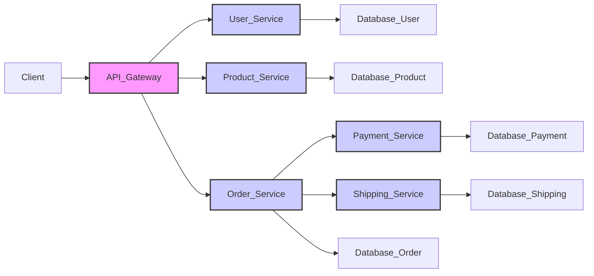

```markdown
# Architecture Overview

This document provides a high-level overview of the system architecture, its key components, and their interactions. It outlines the design principles and best practices followed during the development of the system. This document serves as a guide for developers, architects, and anyone seeking to understand the underlying structure of the application.

## Purpose and Objectives

The primary objectives of this architecture are to:

*   **Scalability:** Design the system to handle increasing workloads and user traffic without significant performance degradation.
*   **Maintainability:** Ensure the system is easy to understand, modify, and debug.
*   **Reliability:** Build a robust system that minimizes downtime and data loss.
*   **Security:** Protect the system and its data from unauthorized access and malicious attacks.
*   **Modularity:** Promote code reusability and independent development through modular design.
*   **Testability:** Facilitate comprehensive testing at various levels (unit, integration, end-to-end).

## Architectural Style

The system employs a **Microservices Architecture**. This approach breaks down the application into a suite of small, independently deployable services. Each service focuses on a specific business capability and communicates with other services through well-defined APIs.

### Key Components

The architecture consists of the following key components:

*   **API Gateway:** The entry point for all external requests. It routes requests to the appropriate microservice, handles authentication and authorization, and provides rate limiting.
*   **Service Discovery:** A mechanism for microservices to locate each other dynamically. This allows services to be scaled up or down without requiring manual configuration updates.
*   **Configuration Management:** A centralized repository for storing and managing application configuration. This allows for easy configuration changes without requiring code deployments.
*   **Message Queue (e.g., RabbitMQ, Kafka):** An asynchronous communication channel for microservices. This enables loose coupling and improved scalability.
*   **Databases:** Each microservice typically has its own dedicated database. This allows for independent data management and avoids data conflicts. Different database technologies may be used depending on the specific requirements of each service.
*   **Monitoring and Logging:** A centralized system for collecting and analyzing logs and metrics from all microservices. This provides insights into system performance and helps identify potential issues.
*   **Individual Microservices:**
    *   **User Service:** Manages user accounts, authentication, and authorization.
    *   **Product Service:** Manages product information, inventory, and pricing.
    *   **Order Service:** Manages order placement, processing, and fulfillment.
    *   **Payment Service:** Handles payment processing and transactions.
    *   **Shipping Service:** Manages shipping logistics and tracking.

### Component Interaction Diagram



## Usage Instructions

This architecture is primarily intended for developers working on the system. To effectively utilize this architecture, follow these guidelines:

1.  **Understand the Microservices Architecture:** Familiarize yourself with the principles and best practices of microservices.
2.  **Identify Service Boundaries:** Clearly define the boundaries of each microservice based on business capabilities.
3.  **Design APIs:** Design well-defined APIs for communication between microservices. Use RESTful APIs with JSON payloads where appropriate. Consider using gRPC for performance-critical services.
4.  **Implement Service Discovery:** Choose a service discovery mechanism (e.g., Consul, etcd, Kubernetes DNS) and integrate it into your microservices.
5.  **Implement Monitoring and Logging:** Integrate your microservices with the centralized monitoring and logging system.
6.  **Follow Security Best Practices:** Implement proper authentication and authorization mechanisms to protect your microservices.
7.  **Write Unit and Integration Tests:** Thoroughly test your microservices to ensure they function correctly and meet the required quality standards.
8.  **Use Infrastructure as Code (IaC):** Automate the provisioning and management of infrastructure using tools like Terraform or CloudFormation.
9.  **CI/CD Pipelines:** Implement continuous integration and continuous delivery (CI/CD) pipelines to automate the build, test, and deployment process.

## Code Examples (Conceptual)

While specific code examples are highly dependent on the chosen technologies and programming languages, here are some conceptual examples illustrating key aspects of the architecture:

**API Gateway Routing (Example using Nginx):**

```nginx
http {
    upstream user_service {
        server user-service-1:8080;
        server user-service-2:8080;
    }

    server {
        listen 80;

        location /users {
            proxy_pass http://user_service;
        }

        # Other service routes
    }
}
```

**Microservice API Endpoint (Example using Python and Flask):**

```python
from flask import Flask, jsonify

app = Flask(__name__)

@app.route('/products/<product_id>')
def get_product(product_id):
    # Logic to retrieve product from database
    product = {'id': product_id, 'name': 'Example Product'}
    return jsonify(product)

if __name__ == '__main__':
    app.run(debug=True, host='0.0.0.0', port=8080)
```

**Message Queue Producer (Example using Python and RabbitMQ):**

```python
import pika

connection = pika.BlockingConnection(pika.ConnectionParameters('localhost'))
channel = connection.channel()

channel.queue_declare(queue='order_queue')

message = 'New order placed!'
channel.basic_publish(exchange='', routing_key='order_queue', body=message)
print(" [x] Sent %r" % message)

connection.close()
```

## Best Practices

*   **Single Responsibility Principle (SRP):** Each microservice should have a single, well-defined responsibility.
*   **Loose Coupling:** Minimize dependencies between microservices to enable independent development and deployment.
*   **Bounded Context:** Define clear boundaries for each microservice based on business context.
*   **Asynchronous Communication:** Use message queues for asynchronous communication between microservices to improve scalability and resilience.
*   **Idempotency:** Design APIs to be idempotent, meaning that multiple identical requests have the same effect as a single request.
*   **Circuit Breaker Pattern:** Implement circuit breakers to prevent cascading failures in case of service outages.
*   **Observability:** Implement comprehensive monitoring and logging to gain insights into system performance and identify potential issues.
*   **Automated Testing:** Implement automated unit, integration, and end-to-end tests to ensure code quality and prevent regressions.
*   **Security Hardening:** Implement robust security measures to protect the system and its data from unauthorized access.

## References

*   **Microservices Architecture:** [https://martinfowler.com/articles/microservices.html](https://martinfowler.com/articles/microservices.html)
*   **Building Microservices (Sam Newman):** A comprehensive book on microservices architecture.
*   **Twelve-Factor App:** [https://12factor.net/](https://12factor.net/) - A methodology for building scalable and maintainable web applications.
*   **Domain-Driven Design (Eric Evans):** A software development approach that focuses on modeling software to match a domain according to input from experts in that domain.
```