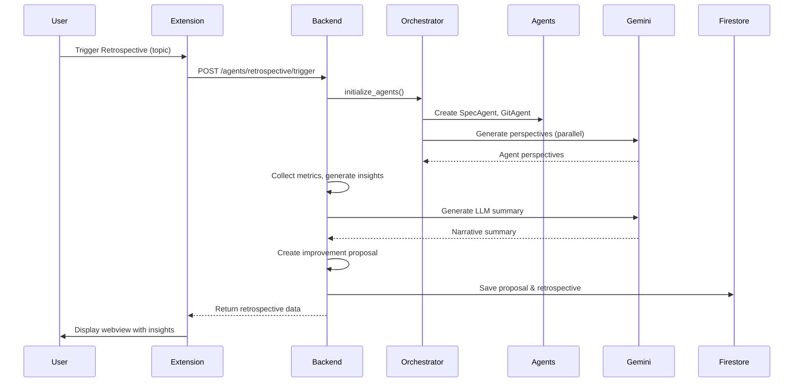
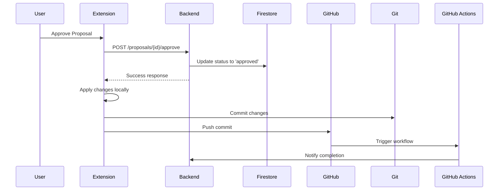

# 🏗️ ContextPilot Architecture

This document describes the architecture of **ContextPilot**, an AI-powered multi-agent development assistant built on Google Cloud Platform with a VS Code/Cursor extension frontend.

---

## 🎯 System Overview

ContextPilot is a **multi-agent AI system** that helps developers by:
- Conducting AI-powered retrospectives with multiple specialized agents
- Automatically generating improvement proposals from insights
- Providing context-aware coaching and guidance
- Tracking project progress and milestones
- Integrating seamlessly into the development workflow via IDE extension

---

## 🏛️ Architectural Style

ContextPilot follows an **Event-Driven Microservices Architecture** with:
- **Multi-Agent System**: Specialized AI agents coordinated by an orchestrator
- **Event Bus**: Asynchronous communication via Google Cloud Pub/Sub (prod) or in-memory (dev)
- **Serverless Compute**: Google Cloud Run for auto-scaling backend
- **NoSQL Database**: Google Firestore for persistent storage
- **IDE Integration**: VS Code/Cursor extension as the primary interface

---

## 🧩 Core Components

### 1. **VS Code Extension** (Frontend)
- **Language**: TypeScript
- **Framework**: VS Code Extension API
- **Bundler**: Webpack 5
- **Purpose**: Primary user interface for developers

**Key Features:**
- Command palette integration (`Ctrl+Shift+P`)
- Sidebar panels (Proposals, Agents, Rewards)
- Webview for rich retrospective reports
- Real-time backend communication via REST API

**Main Files:**
```
extension/
├── src/
│   ├── extension.ts           # Entry point, command registration
│   ├── services/
│   │   └── contextpilot.ts    # API client (Axios)
│   ├── views/
│   │   ├── proposals.ts       # Proposals tree view
│   │   ├── agents.ts          # Agent status view
│   │   └── review-panel.ts    # Retrospective webview
│   └── commands/
│       └── index.ts           # Command handlers
├── webpack.config.js          # Bundle configuration
└── package.json               # Extension manifest
```

---

### 2. **Backend API** (Google Cloud Run)
- **Language**: Python 3.11
- **Framework**: FastAPI (async)
- **Runtime**: Cloud Run (serverless containers)
- **Auto-scaling**: 0 to 10 instances

**Key Endpoints:**
```
GET  /health                              # Health check
POST /agents/retrospective/trigger        # Trigger agent retrospective
GET  /proposals?status=pending            # List proposals
POST /proposals/{id}/approve              # Approve proposal
GET  /agents/status                       # Agent metrics
```

**Main Files:**
```
back-end/
├── app/
│   ├── server.py                    # FastAPI application
│   ├── agents/
│   │   ├── retrospective_agent.py   # Orchestrates retrospectives
│   │   ├── agent_orchestrator.py    # Manages agent lifecycle
│   │   ├── spec_agent.py            # Technical specifications
│   │   └── git_agent.py             # Git workflow automation
│   ├── models/
│   │   └── proposal.py              # Proposal data models
│   └── repositories/
│       ├── proposal_repository.py   # Abstract interface
│       ├── firestore_repository.py  # Firestore implementation
│       └── filesystem_repository.py # Local file implementation
├── Dockerfile                       # Container definition
└── requirements.txt                 # Python dependencies
```

---

### 3. **Multi-Agent System**

#### **Agent Orchestrator**
- **Purpose**: Manages agent lifecycle and coordinates interactions
- **Responsibilities**:
  - Initialize agents on-demand
  - Collect metrics from all agents
  - Generate LLM-powered perspectives from each agent
  - Parallel processing with timeouts

**Managed Agents:**
```
📋 SpecAgent       → Technical specifications and requirements
🔧 GitAgent        → Git workflow and commit automation
🧠 StrategyAgent   → Long-term planning (if available)
```

#### **Retrospective Agent**
- **Purpose**: Conducts AI-powered retrospectives with multiple agents
- **Workflow**:
  1. **Metrics Collection**: Gather events, errors, learnings from all agents
  2. **Agent Discussion**: Each agent provides perspective via LLM (Gemini 2.5-flash)
  3. **Insight Generation**: Identify patterns, idle agents, action items
  4. **LLM Summary**: Generate narrative summary via Gemini 2.5-pro
  5. **Proposal Creation**: Auto-generate improvement proposals from high/medium priority items
  6. **Report Generation**: Save markdown reports with clickable links

**LLM Integration:**
- **Model**: Google Gemini (via REST API)
  - `gemini-2.5-flash`: Fast agent perspectives
  - `gemini-2.5-pro`: High-quality narrative summaries
- **Prompt Engineering**: Context-aware prompts with agent expertise and project context
- **Fallback**: Hardcoded perspectives if LLM fails

---

### 4. **Event Bus**

#### **Development** (In-Memory)
```python
class InMemoryEventBus:
    def publish(self, topic: str, event: dict):
        # Immediate in-process delivery
        for handler in subscribers[topic]:
            handler(event)
```

#### **Production** (Google Cloud Pub/Sub)
```python
class PubSubEventBus:
    def publish(self, topic: str, event: dict):
        publisher.publish(
            topic_path,
            json.dumps(event).encode(),
            timeout=10
        )
```

**Topics:**
- `agent-events`: General agent communication
- `retrospective-events`: Retrospective-specific events

---

### 5. **Data Storage**

#### **Development** (Local Filesystem)
```
.contextpilot/workspaces/{workspace_id}/
├── proposals/
│   ├── retro-proposal-{id}.json
│   └── retro-proposal-{id}.md
├── retrospectives/
│   ├── retro-{id}.json
│   └── retro-{id}.md
└── .agent_state/
    ├── retrospective_state.json
    ├── spec_state.json
    └── git_state.json
```

#### **Production** (Google Firestore)
```
Collections:
├── proposals/
│   └── {proposal_id}          # Document with proposal data
├── retrospectives/
│   └── {retrospective_id}     # Document with retrospective data
└── agent_states/
    └── {agent_id}             # Document with agent metrics
```

**Schema Example (Proposal):**
```javascript
{
  id: "retro-proposal-retro-20251018-162926",
  workspace_id: "contextpilot",
  agent_id: "retrospective",
  title: "Agent Improvements from Retrospective",
  description: "Implement suggested improvements...",
  proposed_changes: [
    {
      file_path: "docs/agent_improvements.md",
      change_type: "create",
      description: "Action plan",
      after: "..."
    }
  ],
  status: "pending",  // pending | approved | rejected
  created_at: "2025-10-18T16:29:26Z",
  metadata: {
    retrospective_id: "retro-20251018-162926",
    action_items_count: 1
  }
}
```

---

## 🔄 System Flow

### **Agent Retrospective Flow**



### **Proposal Approval Flow**



---

## 🌐 Deployment Architecture

### **Development Environment**

```
┌─────────────────────────────────────────┐
│  Developer Machine                      │
│  ┌─────────────────────────────────┐   │
│  │ VS Code/Cursor                  │   │
│  │   └─ ContextPilot Extension     │   │
│  └──────────────┬──────────────────┘   │
│                 │ HTTP (localhost:8000) │
│  ┌──────────────▼──────────────────┐   │
│  │ Backend (uvicorn)               │   │
│  │   • FastAPI                     │   │
│  │   • In-Memory Event Bus         │   │
│  │   • Local File Storage          │   │
│  └─────────────────────────────────┘   │
└─────────────────────────────────────────┘
```

### **Production Environment**

```
┌───────────────────────────────────────────────────────────┐
│  Google Cloud Platform (gen-lang-client-0805532064)       │
│                                                            │
│  ┌──────────────────┐      ┌─────────────────────────┐   │
│  │ Cloud Run        │      │ Cloud Pub/Sub           │   │
│  │ contextpilot-    │─────▶│  • agent-events         │   │
│  │ backend          │◀─────│  • retrospective-events │   │
│  │                  │      └─────────────────────────┘   │
│  │ • FastAPI        │                                     │
│  │ • Python 3.11    │      ┌─────────────────────────┐   │
│  │ • Auto-scaling   │─────▶│ Firestore               │   │
│  │   (0-10 inst)    │      │  • proposals/           │   │
│  └──────────────────┘      │  • retrospectives/      │   │
│          ▲                 │  • agent_states/        │   │
│          │                 └─────────────────────────┘   │
│          │ HTTPS                                          │
└──────────┼────────────────────────────────────────────────┘
           │
┌──────────▼──────────────────┐
│  User's IDE                 │
│  ┌─────────────────────┐    │
│  │ ContextPilot Ext    │    │
│  │ (Bundled .vsix)     │    │
│  └─────────────────────┘    │
└─────────────────────────────┘
```

---

## 🔐 Security & IAM

### **Service Account Permissions**
```bash
# Cloud Run service account needs:
roles/pubsub.publisher       # Publish events to topics
roles/pubsub.subscriber      # Subscribe to topics
roles/datastore.user         # Read/write Firestore
roles/secretmanager.accessor # Access Gemini API key
```

### **API Authentication**
- **Extension → Backend**: Currently unauthenticated (localhost/Cloud Run public)
- **Backend → Gemini**: API key via Secret Manager
- **Backend → Firestore**: Application Default Credentials (ADC)

**Future**: Implement OAuth2 for extension authentication

---

## 📊 Observability

### **Logging**
- **Development**: stdout (DEBUG level)
- **Production**: Google Cloud Logging (INFO level)

**Key Log Events:**
```python
logger.info(f"[RetrospectiveAgent] Conducting retrospective for workspace: {workspace_id}")
logger.debug(f"[Orchestrator] Gemini API response: {response.status_code}")
logger.error(f"[RetrospectiveAgent] Failed to create proposal: {error}")
```

### **Monitoring**
- **Cloud Run Metrics**: Request count, latency, error rate, instance count
- **Pub/Sub Metrics**: Message publish rate, ack rate, undelivered messages
- **Firestore Metrics**: Read/write operations, storage usage

---

## ⚙️ Configuration Management

### **Environment Variables**

| Variable | Dev | Prod | Description |
|----------|-----|------|-------------|
| `ENVIRONMENT` | `development` | `production` | Runtime environment |
| `USE_PUBSUB` | `false` | `true` | Enable Cloud Pub/Sub |
| `FIRESTORE_ENABLED` | `false` | `true` | Enable Firestore |
| `GCP_PROJECT_ID` | *(empty)* | `gen-lang-client-0805532064` | GCP project |
| `GEMINI_API_KEY` | User's key | Secret Manager | Gemini API key |
| `DEFAULT_WORKSPACE_ID` | `default` | `default` | Fallback workspace |
| `LOG_LEVEL` | `DEBUG` | `INFO` | Logging verbosity |

**See**: `back-end/env.dev.example` and `back-end/env.prod.example`

---

## 🚀 CI/CD Pipeline

### **GitHub Actions**

**Workflow: `.github/workflows/apply-proposal.yml`**
- **Trigger**: Manual dispatch or API call
- **Purpose**: Apply approved proposals automatically
- **Steps**:
  1. Fetch proposal from backend
  2. Apply changes to repository
  3. Create commit with proposal details
  4. Push to main branch

**Future Workflows:**
- Automated testing on PR
- Automated deployment to Cloud Run on merge to main
- Security scanning with Trivy/Snyk

---

## 🧪 Testing Strategy

### **Unit Tests**
```python
# tests/test_retrospective_agent.py
def test_conduct_retrospective():
    agent = RetrospectiveAgent(workspace_id="test")
    result = agent.conduct_retrospective(trigger_topic="test")
    assert result["retrospective_id"].startswith("retro-")
    assert len(result["insights"]) > 0
```

### **Integration Tests**
```python
# tests/test_api.py
def test_trigger_retrospective_endpoint():
    response = client.post("/agents/retrospective/trigger", 
        params={"workspace_id": "test"},
        json={"trigger_topic": "test"}
    )
    assert response.status_code == 200
    assert "retrospective_id" in response.json()
```

### **E2E Tests**
- Manual testing via extension
- Automated browser tests with Playwright (future)

---

## 📈 Scalability Considerations

### **Current Scale**
- **Users**: Single developer (local dev)
- **Requests**: ~10-100/day
- **Data**: <1 GB Firestore
- **Cost**: ~$5-10/month (Cloud Run free tier + Firestore)

### **Future Scale** (100+ users)
- **Load Balancing**: Cloud Run auto-scaling (up to 100 instances)
- **Caching**: Redis for frequently accessed proposals
- **Rate Limiting**: API Gateway with quota management
- **Database**: Firestore scales automatically to millions of documents
- **Cost Optimization**: 
  - Min instances = 0 (scale to zero)
  - Request timeouts (prevent runaway costs)
  - Pub/Sub message retention = 7 days

---

## 🔮 Future Architecture Improvements

1. **Agent Plugin System**: Allow third-party agent extensions
2. **Distributed Tracing**: OpenTelemetry for request tracing
3. **GraphQL API**: More flexible querying for complex UIs
4. **Real-time Updates**: WebSocket for live retrospective updates
5. **Multi-Tenancy**: Workspace isolation with RBAC
6. **Blockchain Integration**: On-chain proposals and rewards (Polygon)

---

## 📚 Related Documentation

- **[DEV_VS_PROD.md](back-end/DEV_VS_PROD.md)** - Development vs Production configuration
- **[DEPLOYMENT.md](back-end/DEPLOYMENT.md)** - Cloud Run deployment guide
- **[QUICKSTART.md](QUICKSTART.md)** - Getting started guide
- **[CONTRIBUTING.md](CONTRIBUTING.md)** - Contribution guidelines

---

## 🛠️ Technologies Used

| Layer | Technology | Purpose |
|-------|-----------|---------|
| **Frontend** | TypeScript, VS Code API | IDE extension |
| **Bundling** | Webpack 5 | Extension packaging |
| **Backend** | Python 3.11, FastAPI | REST API |
| **AI/LLM** | Google Gemini 2.5 | Agent perspectives & summaries |
| **Event Bus** | Google Cloud Pub/Sub | Async messaging |
| **Database** | Google Firestore | NoSQL document store |
| **Compute** | Google Cloud Run | Serverless containers |
| **Storage** | Local files (dev) | Markdown/JSON |
| **Secrets** | Google Secret Manager | API keys |
| **CI/CD** | GitHub Actions | Automation |
| **Logging** | Google Cloud Logging | Centralized logs |

---

## 🎯 Design Principles

1. **AI-First**: LLM integration at the core of retrospectives
2. **Event-Driven**: Loose coupling via pub/sub
3. **Serverless**: Auto-scaling, pay-per-use
4. **Developer Experience**: IDE-native, seamless workflow
5. **Observability**: Comprehensive logging and monitoring
6. **Fail-Safe**: Fallbacks for LLM failures
7. **Cost-Efficient**: Scale to zero, optimize API calls

---

*Last updated: 2025-10-18*
*Architecture version: 1.0*
*For questions: contact@livresoltech.com*
