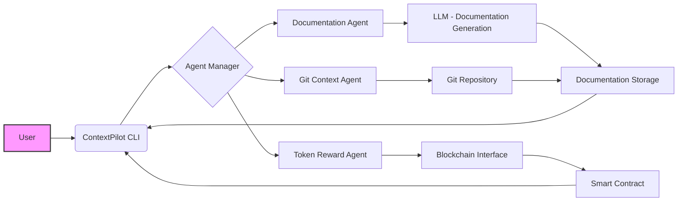

```markdown
# ContextPilot Architecture

## Overview

This document outlines the architectural design of ContextPilot, a multi-agent AI system designed to enhance developer productivity. It details the key components, their interactions, and the overall system flow. Understanding this architecture is crucial for contributing to the project, debugging issues, and extending its functionality.

## Purpose and Objectives

The primary objectives of the ContextPilot architecture are:

*   **Modularity:** To enable independent development and maintenance of individual components.
*   **Scalability:** To accommodate future growth and increasing complexity of projects.
*   **Extensibility:** To allow for the easy addition of new features and agents.
*   **Maintainability:** To ensure the codebase remains understandable and manageable over time.
*   **Integration:** To seamlessly integrate with existing developer tools and workflows.

## Architecture Diagram



## Component Details

ContextPilot is composed of the following key components:

1.  **ContextPilot CLI (Command Line Interface):** This is the primary interface through which users interact with the system. It receives user commands, dispatches them to the appropriate agents, and presents the results.

    *   **Responsibilities:**
        *   Command parsing and validation.
        *   Agent invocation.
        *   Result presentation.
        *   User authentication and authorization.

2.  **Agent Manager:** This component is responsible for managing the lifecycle of individual agents. It handles agent instantiation, communication, and coordination.

    *   **Responsibilities:**
        *   Agent discovery and registration.
        *   Message routing between agents.
        *   Resource allocation for agents.
        *   Error handling and recovery.

3.  **Documentation Agent:** This agent automates the generation and maintenance of project documentation. It uses a Large Language Model (LLM) to analyze code, comments, and commit messages to create comprehensive documentation.

    *   **Responsibilities:**
        *   Code analysis and understanding.
        *   Documentation generation using LLM.
        *   Documentation formatting and styling.
        *   Documentation storage and versioning.

4.  **Git Context Agent:** This agent helps developers manage their Git context by suggesting relevant branches, identifying potential merge conflicts, and providing code snippets.

    *   **Responsibilities:**
        *   Git repository analysis.
        *   Branch management suggestions.
        *   Merge conflict detection.
        *   Code snippet retrieval.

5.  **Token Reward Agent:** This agent rewards developers for their contributions to the project with blockchain tokens. It tracks contributions, calculates rewards, and interacts with a smart contract to distribute tokens.

    *   **Responsibilities:**
        *   Contribution tracking.
        *   Reward calculation.
        *   Blockchain interaction.
        *   Token distribution.

6.  **LLM (Large Language Model):** This is the core component responsible for generating documentation based on the codebase.

    *   **Responsibilities:**
        *   Understanding code semantics.
        *   Generating natural language documentation.
        *   Following documentation style guidelines.

7.  **Git Repository:** This is the version control system used to store the project's code and history.

    *   **Responsibilities:**
        *   Code storage and versioning.
        *   Contribution tracking.
        *   Branch management.

8.  **Blockchain Interface:** This component provides an interface for interacting with the blockchain.

    *   **Responsibilities:**
        *   Smart contract interaction.
        *   Transaction management.
        *   Token management.

9.  **Smart Contract:** This smart contract manages the distribution of tokens to contributors.

    *   **Responsibilities:**
        *   Token storage and management.
        *   Reward distribution logic.
        *   Transaction recording.

10. **Documentation Storage:** This component stores the generated documentation. This could be a file system, a database, or a cloud storage service.

    *   **Responsibilities:**
        *   Documentation storage and retrieval.
        *   Version control.
        *   Access control.

## System Flow

1.  The user interacts with ContextPilot through the CLI.
2.  The CLI parses the user's command and dispatches it to the appropriate agent via the Agent Manager.
3.  The Agent performs its task, potentially interacting with other components such as the LLM, Git Repository, or Blockchain Interface.
4.  The Agent returns the results to the CLI.
5.  The CLI presents the results to the user.

## Best Practices

*   **Loose Coupling:** Design agents to be loosely coupled to minimize dependencies and promote modularity.
*   **Asynchronous Communication:** Use asynchronous communication patterns to avoid blocking operations and improve performance.
*   **Error Handling:** Implement robust error handling mechanisms to ensure system stability.
*   **Logging:** Use comprehensive logging to facilitate debugging and monitoring.
*   **Testing:** Write unit tests and integration tests to ensure the quality of the code.
*   **Configuration Management:** Use a configuration management system to manage environment-specific settings.
*   **Security:** Implement security measures to protect sensitive data and prevent unauthorized access.

## References

*   [Project Scope Document](project_scope.md)
*   [Relevant Research Papers on Multi-Agent Systems]
*   [Documentation for the chosen LLM]
*   [Documentation for the chosen Blockchain Platform]
```