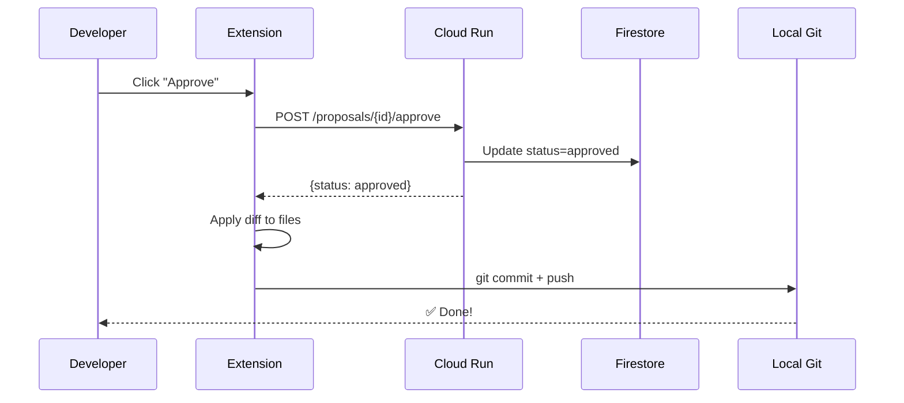
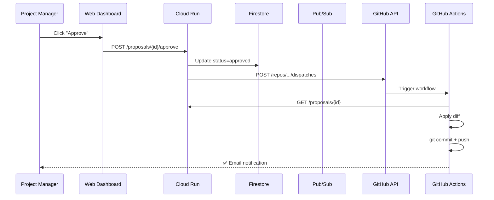

# 🎯 ContextPilot - Product Architecture

## Visão de Produto

**ContextPilot não é só para developers - é uma ferramenta de gestão de projeto colaborativa!**

## 👥 Personas e Use Cases

### Persona 1: Developer (Extension) 👨‍💻

**Quem:**
- Desenvolvedor com acesso ao repositório
- Trabalha localmente no IDE (VSCode/Cursor)
- Tem Git instalado

**Use Case:**
```
1. Developer vê proposal na extension
2. Revisa o diff
3. Aprova
4. Extension aplica mudanças localmente
5. Extension faz commit Git
6. Developer continua trabalhando
```

**Características:**
- ⚡ Instantâneo (< 1s)
- 🔌 Funciona offline
- 💪 Controle total sobre Git

---

### Persona 2: Project Manager / Stakeholder (Web Dashboard) 👔

**Quem:**
- Product Manager
- Tech Lead
- Stakeholder
- Designer
- Não tem repositório local

**Use Case:**
```
1. PM acessa dashboard web
2. Vê proposals pendentes
3. Lê documentação gerada pela IA
4. Aprova proposal
5. GitHub Actions faz commit
6. Mudança refletida no repo
```

**Características:**
- 🌐 Acesso via browser
- ☁️ 100% cloud
- 📱 Mobile-friendly
- 🔐 Controle de permissões

---

## 🏗️ Arquitetura Técnica

### Stack Completo

```
┌─────────────────────────────────────────────────────────────┐
│ FRONTENDS                                                    │
├─────────────────────────────────────────────────────────────┤
│ 1. VSCode/Cursor Extension (TypeScript)                     │
│    └─> Para developers                                      │
│                                                              │
│ 2. Web Dashboard (React + Supabase)                         │
│    └─> Para PMs/Stakeholders                                │
│    └─> Já existe em front-end/                              │
└─────────────────────────────────────────────────────────────┘
                           ↓
┌─────────────────────────────────────────────────────────────┐
│ BACKEND (Cloud Run)                                          │
├─────────────────────────────────────────────────────────────┤
│ FastAPI + Python                                             │
│ - GET /proposals (lista)                                     │
│ - POST /proposals/{id}/approve                               │
│ - GET /proposals/{id} (detalhe)                              │
└─────────────────────────────────────────────────────────────┘
                           ↓
┌─────────────────────────────────────────────────────────────┐
│ STATE & EVENTS                                               │
├─────────────────────────────────────────────────────────────┤
│ Firestore: Persistent storage                                │
│ Pub/Sub: Event bus                                           │
│ Secret Manager: API keys                                     │
└─────────────────────────────────────────────────────────────┘
                           ↓
┌─────────────────────────────────────────────────────────────┐
│ GIT INTEGRATION                                              │
├─────────────────────────────────────────────────────────────┤
│ Extension Users: Git local (simple-git)                      │
│ Web Users: GitHub Actions (via repository_dispatch)         │
└─────────────────────────────────────────────────────────────┘
```

## 🔄 Fluxo de Aprovação

### Origem: Developer (Extension)



**Tempo:** < 2 segundos

---

### Origem: Project Manager (Web)



**Tempo:** ~30-60 segundos (async)

## 📊 Feature Matrix

| Feature | Extension | Web Dashboard |
|---------|-----------|---------------|
| **Ver proposals** | ✅ Sidebar | ✅ Lista paginada |
| **Ver diffs** | ✅ Editor integrado | ✅ Syntax highlight |
| **Aprovar** | ✅ 1 clique | ✅ 1 clique |
| **Git commit** | ✅ Local (instant) | ✅ GitHub Actions (async) |
| **Revisar com AI** | ✅ Claude integrado | ✅ Chat interface |
| **Notificações** | ✅ VSCode toast | ✅ Email + Push |
| **Mobile** | ❌ N/A | ✅ Responsive |
| **Permissões** | ❌ Repo access | ✅ Role-based |

## 🚀 Para o Hackathon

### Demo Script

**Parte 1: Developer Flow (Extension)**
1. "Aqui está um developer usando a extension no Cursor"
2. "O Spec Agent detectou documentação faltando"
3. "Gemini gerou uma proposta com diff completo"
4. "Developer aprova... e commit feito instantaneamente!"

**Parte 2: Manager Flow (Web)**
5. "Agora, o Product Manager não tem acesso ao repo localmente"
6. "Ele acessa o dashboard web do ContextPilot"
7. "Vê as mesmas proposals, pode revisar"
8. "Aprova via browser..."
9. "GitHub Actions automaticamente faz o commit!"
10. "Notificação enviada para o time"

**Impacto:**
- 🎯 **Colaboração** - Não é só para devs
- 🌐 **Acessibilidade** - Web + Extension
- ☁️ **Cloud-native** - Full GCP stack
- 🤖 **AI-powered** - Gemini gerando código
- 🔄 **Event-driven** - Pub/Sub architecture

## 📋 Roadmap de Implementação

### ✅ Fase 1: Core (Feito)
- [x] Cloud Run backend
- [x] Firestore para proposals
- [x] Pub/Sub events
- [x] Extension conecta
- [x] Gemini gerando diffs

### 🔄 Fase 2: Git Integration (Agora)
- [ ] Extension: Git local com simple-git (30 min)
- [ ] Backend: GitHub Actions trigger (feito)
- [ ] Testar fluxo completo

### 🚧 Fase 3: Web Dashboard (Já existe!)
```bash
cd front-end
npm install
npm run dev
```

**O que já tem:**
- ✅ Supabase auth
- ✅ React components
- ✅ API integration
- ✅ Workspace management

**O que falta integrar:**
- [ ] Conectar ao novo Cloud Run URL
- [ ] Adicionar view de proposals
- [ ] Botão de approve

**Tempo:** 1-2 horas

## 💰 Value Proposition

### Para Developers
- ⚡ Commits instantâneos
- 🤖 AI gera código/docs
- 🔍 Revisão inteligente
- 📝 Context sempre atualizado

### Para Product Managers
- 📊 Visibilidade do progresso
- ✅ Aprovar mudanças via web
- 📧 Notificações automáticas
- 🎯 Controle sem Git CLI

### Para a Empresa
- 💰 Menos reuniões
- 🚀 Deploy mais rápido
- 📈 Métricas de produtividade
- 🤝 Melhor colaboração

## 🎪 Pitch para o Hackathon

**"ContextPilot não é só uma ferramenta de developer - é uma plataforma de colaboração AI-powered."**

**Imagine:**
- Product Manager aprova documentação pelo celular
- IA gera o diff perfeito
- GitHub Actions faz o commit
- Developer recebe notificação
- Tudo sem uma linha de código manual

**Stack:**
- ✅ Google Cloud (Cloud Run, Firestore, Pub/Sub)
- ✅ Gemini AI (Google's LLM)
- ✅ GitHub Actions (CI/CD)
- ✅ React + Supabase (Web)
- ✅ VSCode Extension (IDE)

**Resultado:**
- 🚀 10x mais rápido para aprovar mudanças
- 🤖 Zero erros humanos
- 📊 100% rastreável
- 🌍 Acessível de qualquer lugar

---

**Status:** ✅ Arquitetura definida
**Próximos passos:**
1. Implementar Git local na extension (30 min)
2. Integrar Web Dashboard ao Cloud Run (1-2h)
3. Testar fluxo completo (30 min)

**Total:** ~2-3 horas para sistema completo funcionando! 🚀


