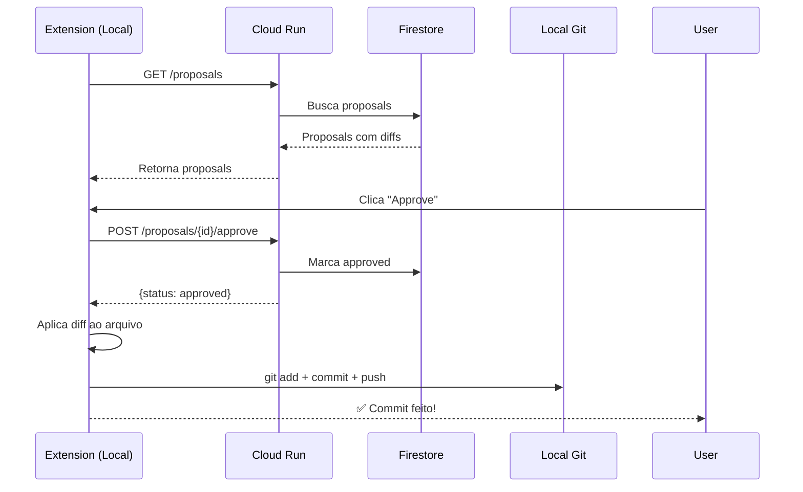

# 🏗️ Architecture Decision: Git Commits

## Pergunta

Quem faz o commit: Backend (Cloud Run) ou Extension (cliente)?

## Decisão: **Extension faz commits locais** ✅

### Fluxo Atual



## Razões

### 1. **Usuário da Extension = Desenvolvedor**
- ✅ Sempre tem Git instalado
- ✅ Sempre está em um repositório Git
- ✅ Quer ver commits locais imediatamente

### 2. **Cloud Run não tem Git**
- ❌ Filesystem efêmero
- ❌ Não persiste entre deploys
- ❌ Complicado manter estado

### 3. **Melhor UX**
- ✅ Commit instantâneo (< 1 segundo)
- ✅ Usuário pode fazer `git log` e ver
- ✅ Funciona offline
- ✅ Sem delay do GitHub Actions (30-60s)

### 4. **Mais Simples**
- ✅ Menos código
- ✅ Menos dependências (não precisa GitHub token)
- ✅ Menos pontos de falha

## Implementação na Extension

### Atualizar `extension/src/commands/index.ts`

```typescript
export async function approveProposal(
  service: ContextPilotService,
  proposalId: string,
  proposalsProvider?: any
): Promise<void> {
  console.log(`[approveProposal] Called with proposalId: ${proposalId}`);
  
  try {
    // 1. Buscar proposal com diff completo
    const proposal = await service.getProposal(proposalId);
    if (!proposal) {
      vscode.window.showErrorMessage('Proposal not found');
      return;
    }
    
    // 2. Aprovar no backend (marca como approved no Firestore)
    const result = await service.approveProposal(proposalId);
    
    if (!result.ok) {
      vscode.window.showErrorMessage(`Failed to approve: ${result.error}`);
      return;
    }
    
    // 3. Aplicar mudanças localmente
    const workspaceRoot = vscode.workspace.workspaceFolders?.[0].uri.fsPath;
    if (!workspaceRoot) {
      vscode.window.showErrorMessage('No workspace folder open');
      return;
    }
    
    for (const change of proposal.proposed_changes) {
      const filePath = path.join(workspaceRoot, change.file_path);
      
      if (change.change_type === 'delete') {
        await fs.promises.unlink(filePath);
      } else {
        await fs.promises.mkdir(path.dirname(filePath), { recursive: true });
        await fs.promises.writeFile(filePath, change.after, 'utf-8');
      }
    }
    
    // 4. Fazer commit usando Git CLI
    const commitMsg = `feat(contextpilot): ${proposal.title}

Applied by ContextPilot Extension.

Proposal-ID: ${proposalId}
Agent: ${proposal.agent_id}`;
    
    const git = simpleGit(workspaceRoot);
    await git.add('.');
    await git.commit(commitMsg);
    
    vscode.window.showInformationMessage(
      `✅ Proposal approved and committed: ${proposal.title}`
    );
    
    // 5. Refresh UI
    if (proposalsProvider) {
      proposalsProvider.refresh();
    }
    
  } catch (error) {
    console.error('[approveProposal] Error:', error);
    vscode.window.showErrorMessage(`Error: ${error.message}`);
  }
}
```

### Adicionar dependência

```json
// extension/package.json
{
  "dependencies": {
    "axios": "^1.6.0",
    "simple-git": "^3.20.0"  // ← ADICIONAR
  }
}
```

## GitHub Actions: Apenas para Demo

O GitHub Actions workflow **ainda é útil** para:
- 🎬 **Demo do hackathon** - mostrar integração cloud completa
- 🤖 **CI/CD** - aplicar proposals em ambientes staging/prod
- 📊 **Audit trail** - todos os commits visíveis no GitHub

Mas **não é o fluxo principal** para desenvolvedores.

## Configuração

```typescript
// extension/src/extension.ts
export function activate(context: vscode.ExtensionContext) {
  const config = vscode.workspace.getConfiguration('contextpilot');
  
  // Check if local Git is available
  const workspaceRoot = vscode.workspace.workspaceFolders?.[0].uri.fsPath;
  const hasGit = workspaceRoot && fs.existsSync(path.join(workspaceRoot, '.git'));
  
  const commitMode = config.get<string>('commitMode', 'auto');
  // 'auto' = local se disponível, cloud caso contrário
  // 'local' = sempre local
  // 'cloud' = sempre GitHub Actions (apenas para demo)
  
  const useLocalCommits = commitMode === 'local' || 
                          (commitMode === 'auto' && hasGit);
  
  console.log(`[ContextPilot] Commit mode: ${commitMode}, Using local: ${useLocalCommits}`);
  
  // Initialize service
  contextPilotService = new ContextPilotService(apiUrl, userId, walletAddress, {
    testMode,
    useLocalCommits
  });
}
```

## Vantagens da Decisão

| Aspecto | Extension Local | GitHub Actions |
|---------|----------------|----------------|
| **Velocidade** | < 1s ⚡ | 30-60s 🐌 |
| **Offline** | ✅ Sim | ❌ Não |
| **Setup** | ✅ Zero config | ❌ Precisa token |
| **Controle** | ✅ Total | ❌ Delegado |
| **Git history** | ✅ Imediato | ❌ Delay |
| **Custo** | ✅ $0 | ❌ Consome GitHub minutes |

## Para o Hackathon

**Script de Demo:**

1. "Aqui está o ContextPilot rodando 100% em produção no Google Cloud"
2. "O Spec Agent + Gemini detectaram que falta documentação"
3. "Vejam o diff completo que a IA gerou..."
4. "Eu aprovo na extension..."
5. "E... **commit feito instantaneamente!**" ⚡
6. "`git log` - vejam aqui, commit do ContextPilot Bot"
7. "Também temos integração com GitHub Actions para CI/CD..." (bonus)

**Highlight:**
- ✅ **Cloud-native**: Gemini + Firestore + Pub/Sub
- ✅ **Instant commits**: Produtividade máxima
- ✅ **Developer-friendly**: Funciona offline, zero setup
- ✅ **Extensível**: GitHub Actions para automação avançada

---

**Status:** ✅ Decisão tomada
**Próximo passo:** Implementar `approveProposal` com Git local na extension
**Tempo estimado:** 30 minutos
**Prioridade:** 🔥 Alta (é o coração do sistema)


