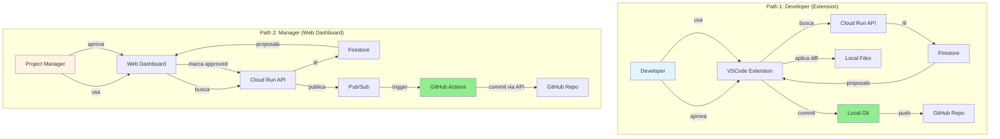

# 🎭 ContextPilot: Arquitetura para Dois Personas

## 💡 Visão de Produto

**ContextPilot é uma plataforma de colaboração AI-powered para gestão de projetos de software.**

Não é apenas para developers - é para **todo o time**.

---

## 👥 Personas

### 👨‍💻 Persona 1: Developer
**Ferramentas:** VSCode/Cursor Extension
**Ambiente:** Local (com Git)
**Workflow:** Rápido e interativo

### 👔 Persona 2: Project Manager / Stakeholder
**Ferramentas:** Web Dashboard
**Ambiente:** Browser (sem Git)
**Workflow:** Review e aprovação remota

---

## 🏗️ Arquitetura Dual-Path



## 📋 Comparação Detalhada

| Aspecto | Developer (Extension) | Manager (Web) |
|---------|----------------------|---------------|
| **Interface** | VSCode/Cursor | Browser |
| **Git** | Local (instalado) | Remoto (GitHub API) |
| **Velocidade** | < 1s ⚡ | 30-60s 🕐 |
| **Offline** | ✅ Sim | ❌ Não |
| **Mobile** | ❌ Desktop only | ✅ Responsive |
| **Setup** | ✅ Zero config | ❌ Precisa login |
| **Controle** | ✅ Total | 🔐 Role-based |
| **Notificações** | VSCode toast | Email + Push |

## 🔄 Fluxos Detalhados

### Flow 1: Developer Approval (Extension)

```typescript
// Pseudo-código da extension
async function approveProposal(proposalId: string) {
  // 1. Marca como approved no Firestore (Cloud)
  await api.post(`/proposals/${proposalId}/approve`);
  
  // 2. Aplica mudanças localmente (Local)
  for (const change of proposal.proposed_changes) {
    fs.writeFileSync(change.file_path, change.after);
  }
  
  // 3. Commit Git local (Local)
  await git.add('.');
  await git.commit(message);
  
  // ✅ Done! (<1s)
}
```

**Vantagens:**
- ⚡ Instantâneo
- 🔌 Funciona offline depois de baixar proposals
- 💪 Developer mantém controle total
- 📝 Vê mudanças antes de push

---

### Flow 2: Manager Approval (Web Dashboard)

```typescript
// Pseudo-código do web dashboard
async function approveProposal(proposalId: string) {
  // 1. Marca como approved no Firestore
  await api.post(`/proposals/${proposalId}/approve`);
  
  // 2. Backend dispara GitHub Actions
  await github.dispatch('proposal-approved', {
    proposal_id: proposalId
  });
  
  // 3. GitHub Actions (async)
  // - Clona repo
  // - Aplica diff
  // - Commit
  // - Push
  
  // 4. Notifica PM via email
  await sendEmail('Proposal approved and committed!');
  
  // ✅ Done! (~60s, async)
}
```

**Vantagens:**
- 🌐 Acesso remoto
- 📱 Mobile-friendly
- 🔐 Controle de permissões
- 📧 Notificações automáticas

---

## 🎯 Use Cases

### Use Case 1: Daily Development
**Persona:** Developer
**Ferramenta:** Extension

```
1. Morning: Abre Cursor, vê 3 proposals de docs
2. Revisa diffs gerados pelo Gemini
3. Aprova 2, rejeita 1
4. Commits feitos automaticamente
5. Continue coding
6. Push no final do dia
```

**Tempo total:** < 2 minutos
**Commits:** 2 (locais)

---

### Use Case 2: Remote Review
**Persona:** Product Manager
**Ferramenta:** Web Dashboard

```
1. Recebe email: "5 proposals pendentes"
2. Acessa dashboard no celular
3. Revisa proposals durante almoço
4. Aprova 3, adiciona comentários em 2
5. GitHub Actions faz commits
6. Developer recebe notificação
```

**Tempo total:** 10 minutos
**Commits:** 3 (via GitHub API)

---

## 🚀 Stack Técnico Completo

### Frontend Layer
```
VSCode Extension (TypeScript + simple-git)
    ↓
    Developer path (local Git)

Web Dashboard (React + Supabase)
    ↓
    Manager path (GitHub Actions)
```

### Backend Layer
```
Cloud Run (FastAPI)
    ├─> Firestore (proposals, state)
    ├─> Pub/Sub (events)
    ├─> Secret Manager (tokens)
    └─> Gemini AI (content generation)
```

### Git Integration Layer
```
simple-git (Extension → Local Git)
    ↓
    Instant commits

GitHub API (Web → GitHub Actions)
    ↓
    Async commits
```

## 💰 Value Proposition

### Para Developers
- ⚡ **10x mais rápido** - Commits automáticos
- 🤖 **Zero erros** - IA gera conteúdo
- 📝 **Sempre atualizado** - Context tracking
- 🔍 **Revisão inteligente** - Claude integrado

### Para Product Managers
- 📊 **Visibilidade total** - Dashboard em tempo real
- ✅ **Aprovar remotamente** - Sem precisar de Git
- 📧 **Notificações** - Mantenha-se informado
- 🎯 **Controle** - Sem ser blocker

### Para a Organização
- 💰 **Menos reuniões** - Aprovações assíncronas
- 🚀 **Deploy mais rápido** - Menos fricção
- 📈 **Métricas** - Produtividade rastreável
- 🤝 **Colaboração** - Tech + Non-tech juntos

## 🎪 Pitch para Hackathon

### Abertura
> "Quem aqui já perdeu tempo esperando aprovação de documentação?"
> 
> [Mãos levantadas]
> 
> "E quem aqui já teve que explicar Git para um PM?"
> 
> [Risadas]

### Demo Live
1. **Developer flow:** Extension → Instant commit
2. **Manager flow:** Web → GitHub Actions
3. **AI magic:** Gemini gerando docs
4. **Cloud-native:** Full GCP stack

### Fechamento
> "ContextPilot: Colaboração sem fricção, powered by AI"
> 
> **Features:**
> - 🤖 AI agents detectando problemas
> - 📝 Gemini gerando soluções
> - ⚡ Developers: commits instantâneos
> - 🌐 Managers: aprovação via web
> - ☁️ 100% cloud, 100% escalável

---

## 📊 Roadmap

### ✅ Fase 1: MVP Backend (Completo)
- Cloud Run + Firestore + Pub/Sub
- Gemini integration
- Proposals com diffs

### ✅ Fase 2: Extension (Completo)
- Conecta ao Cloud Run
- Lista proposals
- Commits Git locais

### 🚧 Fase 3: Web Dashboard (50% completo)
- ✅ Frontend existe (React + Supabase)
- ❌ Integrar com Cloud Run
- ❌ View de proposals
- ❌ GitHub Actions trigger

### 🎯 Fase 4: Advanced Features
- Notificações (email, Slack)
- Permissões granulares
- Analytics dashboard
- Marketplace de agents

---

**Status:** ✅ Core pronto para demo
**Tempo até demo completo:** 2-3 horas
**Diferencial:** Colaboração cross-team com AI


