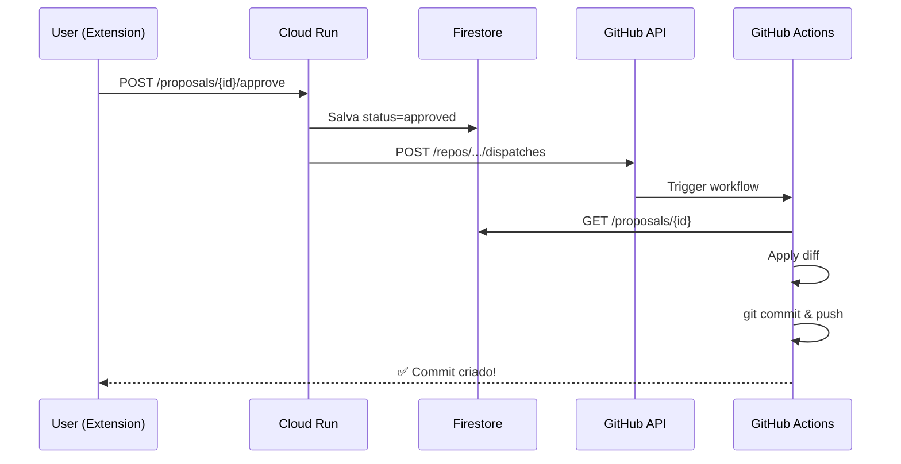

# 🚀 GitHub Actions Integration - Setup Guide

## O que foi implementado

✅ GitHub Actions workflow (`.github/workflows/apply-proposal.yml`)
✅ API endpoint para disparar o workflow
✅ Terraform configurado para GitHub Token
✅ Integração completa Cloud → GitHub

## 📋 Setup (3 passos)

### 1. Criar GitHub Personal Access Token

1. Vá para: https://github.com/settings/tokens/new
2. Nome: `ContextPilot Cloud Run`
3. Expiration: `No expiration` (ou 1 ano)
4. **Scopes necessários:**
   - ✅ `repo` (Full control of private repositories)
   - ✅ `workflow` (Update GitHub Action workflows)

5. Clique em **Generate token**
6. **COPIE O TOKEN** (você não verá novamente!)

### 2. Adicionar token ao GCP Secret Manager

```bash
# Adicione o token ao Secret Manager
echo -n "SEU_GITHUB_TOKEN_AQUI" | gcloud secrets create GITHUB_TOKEN \
  --data-file=- \
  --project=gen-lang-client-0805532064

# OU se já criou, adicione uma nova versão:
echo -n "SEU_GITHUB_TOKEN_AQUI" | gcloud secrets versions add GITHUB_TOKEN \
  --data-file=- \
  --project=gen-lang-client-0805532064
```

### 3. Deploy da infraestrutura

```bash
cd terraform

# Aplicar Terraform (cria secret e atualiza Cloud Run)
terraform apply -auto-approve

# OU deploy manual do Cloud Run:
cd ../back-end
docker build -t gcr.io/gen-lang-client-0805532064/contextpilot-backend:latest .
docker push gcr.io/gen-lang-client-0805532064/contextpilot-backend:latest

gcloud run deploy contextpilot-backend \
  --image gcr.io/gen-lang-client-0805532064/contextpilot-backend:latest \
  --region us-central1 \
  --project gen-lang-client-0805532064 \
  --quiet
```

## 🧪 Testar

### Teste Manual do Workflow

```bash
# 1. Criar uma proposal
curl -X POST "https://contextpilot-backend-581368740395.us-central1.run.app/proposals/create?workspace_id=contextpilot" \
  -H "Content-Type: application/json" -d '{}'

# 2. Pegar o ID da proposal
PROPOSAL_ID=$(curl -s "https://contextpilot-backend-581368740395.us-central1.run.app/proposals?workspace_id=contextpilot" \
  | jq -r '.proposals[0].id')

echo "Proposal ID: $PROPOSAL_ID"

# 3. Aprovar (deve disparar GitHub Actions)
curl -X POST "https://contextpilot-backend-581368740395.us-central1.run.app/proposals/$PROPOSAL_ID/approve?workspace_id=contextpilot" \
  -H "Content-Type: application/json" | jq .

# 4. Verificar GitHub Actions
# Vá para: https://github.com/fsegall/gcloud_contextpilot/actions
# Deve aparecer um workflow "Apply ContextPilot Proposals" rodando!
```

### Teste via Extension

1. Abra a extension no Cursor
2. Veja as proposals na sidebar
3. Clique em "Approve" em uma proposal
4. Vá para GitHub Actions e veja o commit sendo criado!

## 🔍 Verificar Logs

```bash
# Logs do Cloud Run
gcloud logging read "resource.type=cloud_run_revision \
  AND resource.labels.service_name=contextpilot-backend \
  AND textPayload=~'GitHub'" \
  --limit 20 \
  --project gen-lang-client-0805532064

# Ver commits criados pelo bot
git log --author="ContextPilot Bot"
```

## 🎯 Fluxo Completo



## ⚠️ Troubleshooting

### Erro: "Resource not accessible by integration"
- O GitHub Token não tem as permissões corretas
- Recrie o token com `repo` e `workflow` scopes

### Erro: "Bad credentials"
- Token inválido ou expirado
- Recrie e atualize no Secret Manager

### Workflow não dispara
- Verifique se o secret GITHUB_TOKEN existe no GCP
- Verifique os logs do Cloud Run

### Commit não aparece no GitHub
- Verifique os logs do GitHub Actions
- O workflow pode ter falhado ao aplicar o diff

## 📊 Métricas de Sucesso

Para o Hackathon, demonstrar:
- ✅ Proposal criada pelo Gemini
- ✅ Aprovação na Extension
- ✅ GitHub Actions disparado automaticamente
- ✅ Commit aparece no GitHub
- ✅ **100% cloud-native** (sem Git local)

---

**Tempo estimado de setup:** 10-15 minutos
**Complexity:** Baixa ⭐⭐☆☆☆
**Impact:** Alta 🚀🚀🚀🚀🚀
